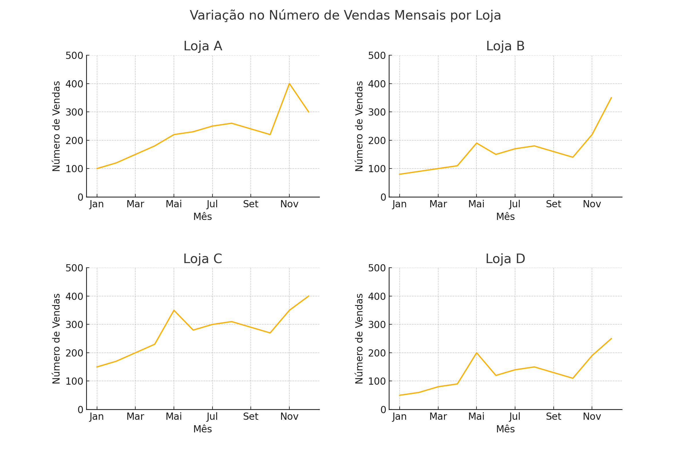

# 📊 Análise de Vendas Mensais por Loja - 2022

  
  


Este repositório apresenta uma análise visual e descritiva do desempenho de vendas de quatro lojas fictícias ao longo do ano de 2022. A análise foi conduzida com Python utilizando as bibliotecas `pandas` e `matplotlib`, e está estruturada para facilitar a compreensão dos padrões mensais e sazonais de cada loja.

---

## 🧠 Objetivo

Identificar padrões de comportamento de vendas, comparar o desempenho entre lojas e oferecer insights acionáveis com base nas variações mensais de vendas ao longo de 2022.

---

## 📁 Estrutura do Projeto

📂 analise_vendas_2022

├── 📊 analise_vendas.ipynb # Notebook com visualizações e análises

├── 📄 README.md # Este arquivo

└── 📈 vendas_2022.png # Imagem dos gráficos (opcional)


---

## 📌 Descrição dos Dados

As lojas analisadas foram:

- **Loja A**
- **Loja B**
- **Loja C**
- **Loja D**

As vendas mensais estão distribuídas do mês de **Janeiro a Dezembro de 2022**, representando o número de vendas unitárias por loja.

---

## 📊 Visualização Gráfica

Foram criados **gráficos de linha** para cada loja com o objetivo de comparar os comportamentos mensais de maneira visual:

<p align="center">
  
</p>

---

## 📈 Análises Relevantes

### 🔍 Sazonalidade:
- Forte aumento nas vendas em **Novembro e Dezembro**, comum às quatro lojas.
- Indica influência de eventos comerciais como **Black Friday** e **Natal**.

### 🏆 Destaques por Loja:

- **Loja C**: Maior volume de vendas, crescimento constante.
- **Loja A**: Boa performance, mas **queda inesperada em Dezembro**.
- **Loja D**: Volume mais baixo de vendas, demanda por ações corretivas.

---

## 💡 Insights Estratégicos

| Insight | Ação Recomendável |
|--------|-------------------|
| 📈 Sazonalidade alta no fim do ano | Refine estratégias promocionais para nov/dez |
| 🏅 Loja C como referência | Avaliar e replicar boas práticas |
| ⚠️ Queda da Loja A em Dezembro | Investigar falhas operacionais |
| 🚨 Baixo desempenho da Loja D | Reavaliar estratégia comercial e equipe |

---

## 🚀 Tecnologias Utilizadas

- [Python 3.10](https://www.python.org/)
- [Pandas](https://pandas.pydata.org/)
- [Matplotlib](https://matplotlib.org/)
- Google Colab / Jupyter Notebook

---

## 👨‍💻 Autor

**Luiz André de Souza**  
📘 GitHub: [@brodyandre](https://github.com/brodyandre)  
📧 E-mail: *(adicione seu email se quiser)*

---

## 📄 Licença

Este projeto está licenciado sob a **MIT License** - consulte o arquivo [LICENSE](LICENSE) para mais detalhes.

---

> Sinta-se à vontade para clonar este repositório, executar os notebooks e propor melhorias!

## ✅ Instruções

1. Salve o conteúdo acima como README.md no repositório GitHub.

2. Opcionalmente, adicione a imagem dos gráficos salvos (como vendas_2022.png) no mesmo diretório para aparecer no visualizador.

3. Faça o push do seu repositório com:

```bash
git add README.md
git commit -m "Adiciona documentação da análise de vendas 2022"
git push origin main
```


